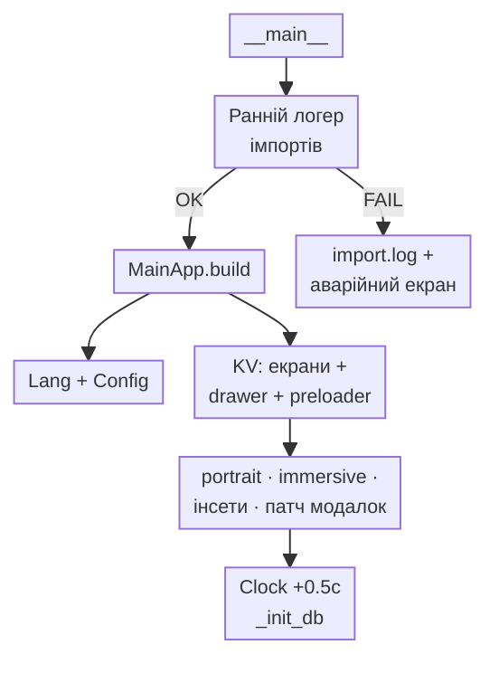
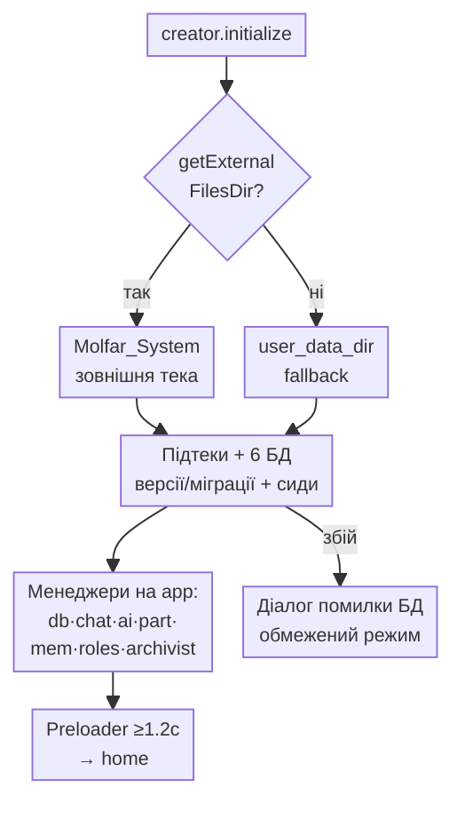
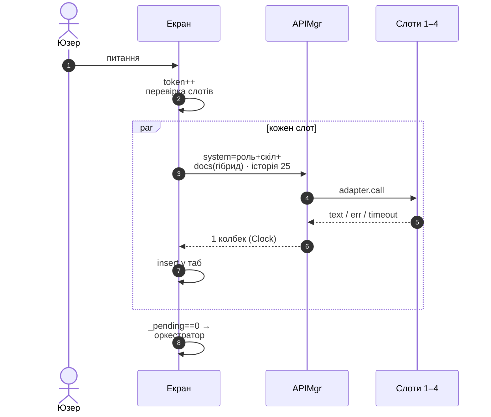
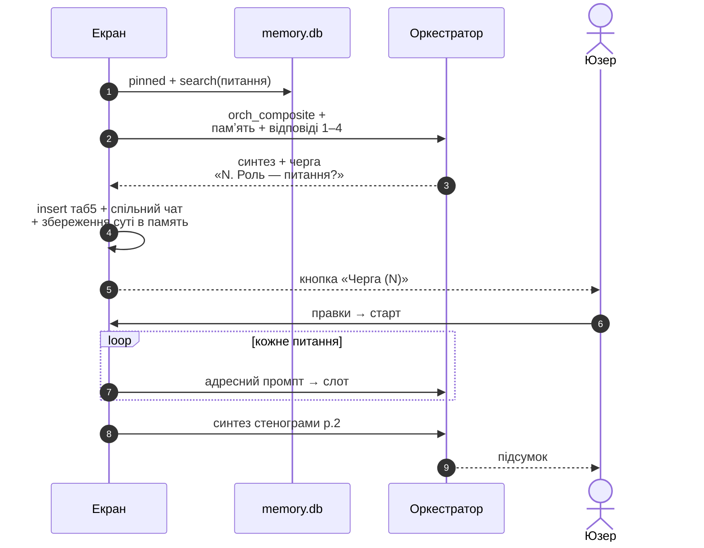
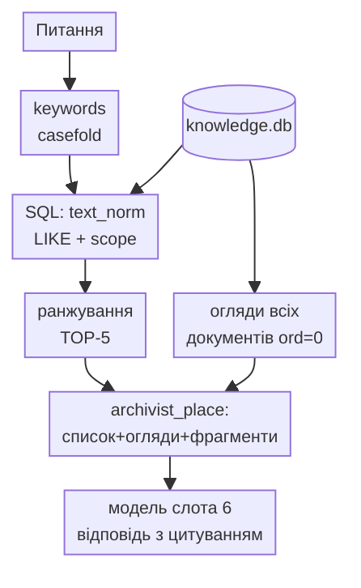
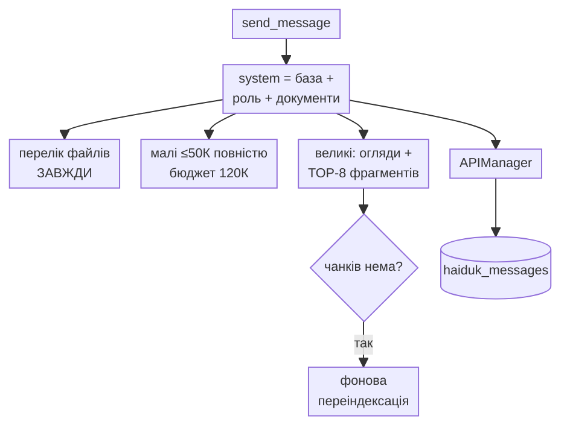
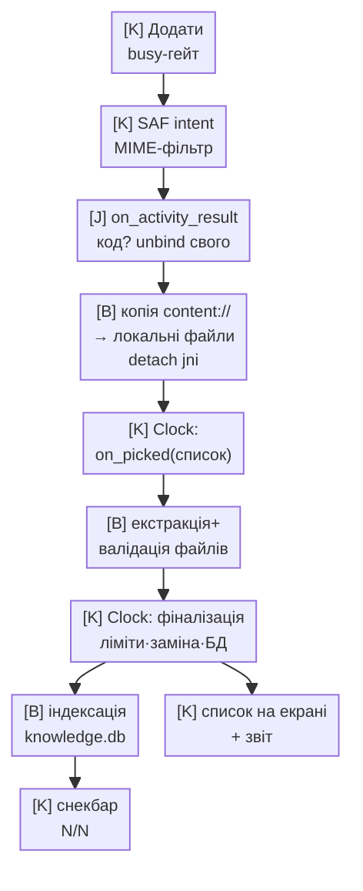
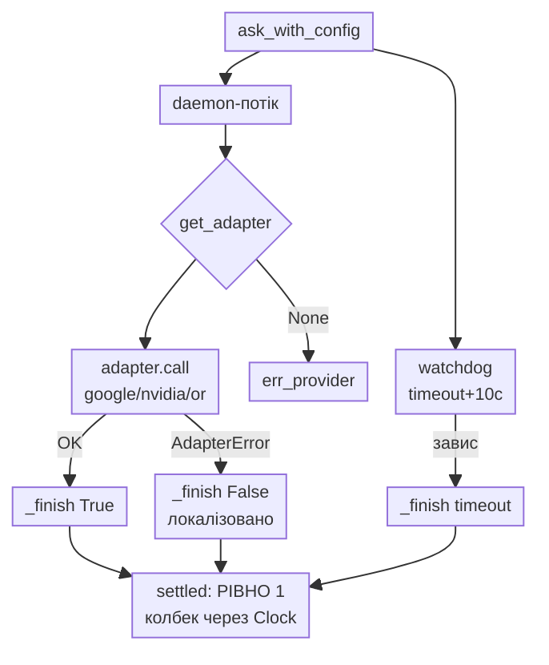
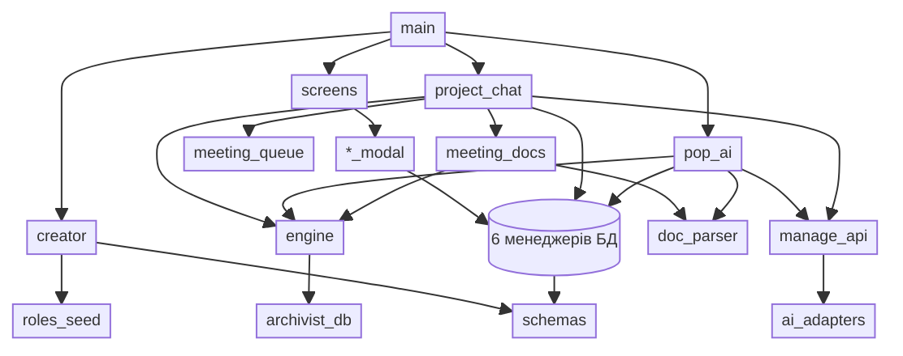

# 12. Схеми процесів

> Актуально: 2026-07. Стандарт компактності (для екрана телефона):
> init-директива нижче + короткі підписи з ` ` + орієнтація TD +
> великі процеси порізані на кілька малих діаграм.
> Директиву копіювати ПЕРШИМ рядком у кожну нову діаграму:
> `%%{init: {"themeVariables":{"fontSize":"11px"},"flowchart":{"nodeSpacing":18,"rankSpacing":22,"padding":4}}}%%`

## 1. Старт застосунку

## 2. Раунд наради — фаза 1 (паралель)

## 3. Раунд наради — фаза 2 (Оркестратор + черга)

## 4. Секретар (слот 6)

Протокол: підсумки таба 5 + метадані + склад → archivist_protocol →
Exports + Download.

## 5. Гайдук: повідомлення з гібридною подачею

## 6. Додавання документів (канон потоків!) 
Позначки: `[J]`=Java-потік, `[B]`=фоновий, `[K]`=Kivy.

## 7. Потік AI-запиту (спільний)

## 8. Залежності модулів (спрощено)

