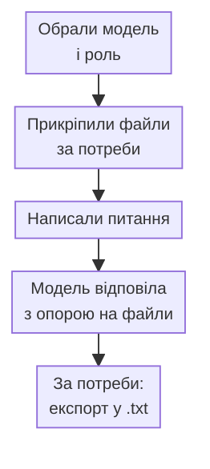
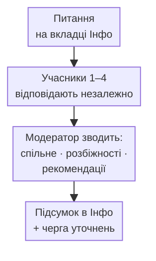
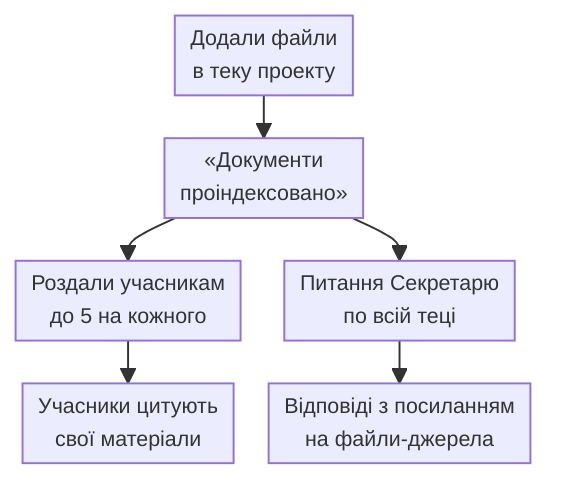
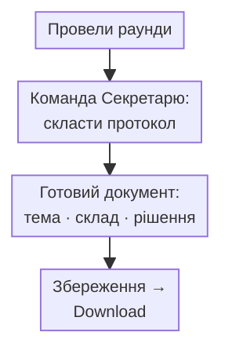

# 12. Схеми процесів (наочно)

> Що за чим слідує і який результат. Без технічних деталей.

## 1. Швидке питання в Гайдуку


## 2. Раунд наради


## 3. Черга уточнень (раунд 2)
```mermaid
%%{init: {"themeVariables":{"fontSize":"11px"},"flowchart":{"nodeSpacing":18,"rankSpacing":22,"padding":4}}}%%
flowchart TD
    A[Кнопка «Черга (N)»] --> B[Правите питання<br/>й адресатів]
    B --> C[Питання ставляться<br/>по одному, привселюдно]
    C --> D[Фінальний висновок<br/>модератора]
```

## 4. Документи → відповіді по суті


## 5. Протокол

