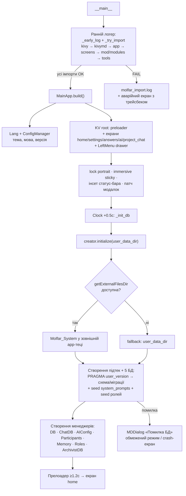
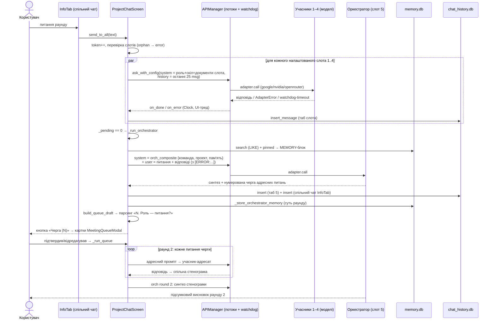
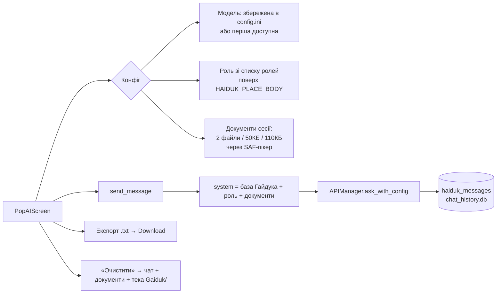
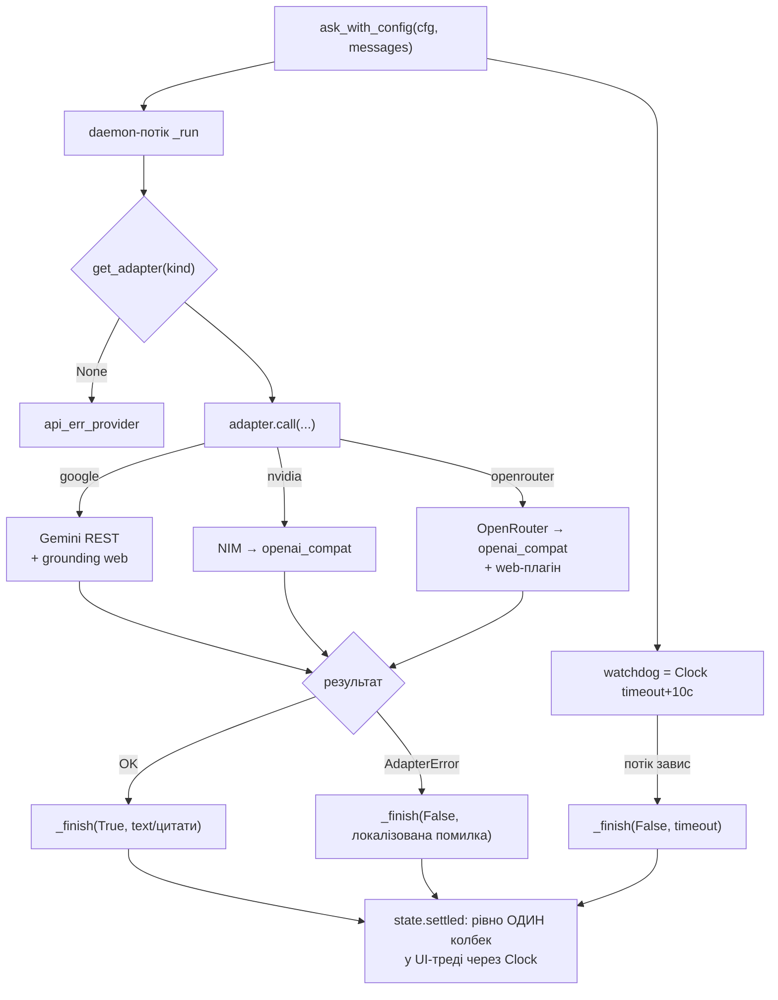
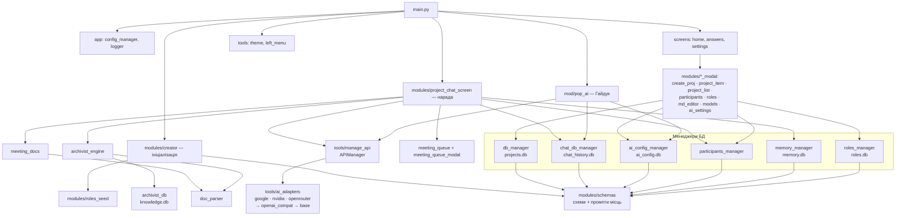

# Molfar System — структура проекту, опис і аналіз

> Згенеровано за станом кодової бази на 2026-07-03.
> Стек: Python 3.11 (p4a) / 3.13 (Pydroid) · Kivy 2.3.0 · KivyMD 1.2.0 · SQLite (без FTS5) · requests.
> Пакет: `org.molfar.system.molfarsystem`. Збірка: GitHub Actions → buildozer → p4a v2024.01.21, sdl2, arm64-v8a + armeabi-v7a, API 33 / minapi 24.

---

## 1. Що це за додаток

**Molfar System** — Android-застосунок (Kivy/KivyMD, без root) для **AI-конференцій**: кілька AI-учасників на різних моделях і провайдерах (Google Gemini, NVIDIA NIM, OpenRouter) спілкуються в межах проекту.

Ключові сутності:

- **Проекти** трьох активних типів: `conference` (конференція), `meeting` (нарада), `orduino` (спецтип); тип `quick` лишився у схемі/коді, але прибраний з UI.
- **Слоти учасників 1–6**: 1–4 — робочі AI-учасники (кожен зі своєю моделлю, роллю і документами), 5 — **Оркестратор** (модератор: синтезує відповіді раунду, веде прямий діалог, формує чергу адресних питань), 6 — **Секретар/Архіваріус** (відповідає лише про вміст документів проекту, складає офіційний протокол засідання; у раундах не бере участі).
- **Раунд**: питання користувача паралельно йде учасникам 1–4 (кожен відповідає незалежно, не бачачи інших), після чого Оркестратор синтезує підсумок і пропонує чергу follow-up питань («адресне привселюдно» — питання одному, бачать усі).
- **Гайдук** — одиночний чат «Швидкі запитання» (екран `pop_ai`) з вибором моделі, накладними ролями та документами сесії.
- **Ролі** — каталог «спеціалістів» (промпт + скіл) двох видів: для учасників і для оркестраторів; builtin-ролі сідяться з `roles_seed.py`, дзеркаляться в `.md`-файли на диску.
- **Довготривала пам'ять** проектів (`memory.db`) — факти/рішення/задачі, які Оркестратор витягає і використовує між нарадами.
- **Двигун знань** (`knowledge.db`, Архіваріус) — чанкування документів + LIKE-пошук фрагментів + веб-джерела (цитати з веб-пошуку провайдерів).
- **Локалізація**: 5 мов (ua/en/de/es/fr), FAQ-екран, теми Dark/Light.

Всі дані — у app-specific теці `getExternalFilesDir()/Molfar_System` (Scoped Storage, без дозволів). Експорт назовні — через MediaStore.Downloads (API 29+) або legacy-запис (API 24–28).

---

## 2. Повна файлова структура

> Шляхи відновлено за шапками файлів (`# modules/...`) та імпортами в `main.py`.

```text
/  (корінь репозиторію = source.dir)
├── main.py                     Точка входу: ранній логер імпортів, crash-log
│                               («чорна скринька»), клас Lang (i18n), MainApp:
│                               побудова екранів, drawer, ініціалізація БД,
│                               immersive-режим, інсети статус-бара, аварійний екран.
├── buildozer.spec              Конфіг збірки APK (p4a v2024.01.21, API 33,
│                               build-tools 33.0.2, archs arm64+armeabi, requirements).
├── config.ini                  Дефолтний конфіг (тема/мова) — робочий config.ini
│                               створюється в user_data_dir через ConfigManager.
│
├── app/                        Прикладний «фундамент»
│   ├── config_manager.py      ConfigManager: config.ini у user_data_dir —
│   │                           тема, мова, збережений вибір Гайдука (модель/роль).
│   └── logger.py              get_logger(): єдиний логер 'molfar.<name>' поверх
│                               logging (stdout → logcat на Android).
│
├── lang/                       Локалізація (5 мов × 270 ключів + FAQ)
│   ├── ua.ini  en.ini  de.ini  es.ini  fr.ini
│   └── faq_ua.json  faq_en.json  faq_de.json  faq_es.json  faq_fr.json
│
├── screens/                    Прості екрани
│   ├── home.py                Головний екран: банер, блоки проектів за типами
│   │                           (conference/meeting/orduino), pull-to-refresh.
│   ├── answers.py             FAQ-акордеон з lang/faq_<мова>.json.
│   └── settings.py            Налаштування: мова, тема, вхід у AI-провайдери.
│
├── mod/
│   └── pop_ai.py              PopAIScreen («Гайдук», швидкі запитання):
│                               одиночний чат, вибір моделі з усіх провайдерів,
│                               накладні ролі, документи сесії (2 файли / 50КБ /
│                               110КБ), експорт .txt, пам'ять haiduk_messages.
│
├── modules/                    Ядро домену
│   ├── schemas.py             ЄДИНЕ джерело правди SQL-схем і версій усіх БД,
│   │                           PRAGMA-набір (WAL/FK/busy_timeout), системні
│   │                           промпти місць: Оркестратор (composite/direct),
│   │                           Архіваріус (place/protocol), база Гайдука.
│   ├── creator.py             initialize(): резолв базової теки (getExternalFilesDir
│   │                           → fallback user_data_dir), створення підтек,
│   │                           setup+міграції 5 БД, seed системних промптів і ролей.
│   ├── db_manager.py          projects.db: CRUD проектів (4 таблиці-типи через
│   │                           whitelist TABLE_MAP), спільні документи проекту,
│   │                           документи слотів; async-патерн: воркер-потік +
│   │                           Clock.schedule_once назад в UI.
│   ├── chat_db_manager.py     chat_history.db: повідомлення табів 1..6 з живим
│   │                           вікном HISTORY_WINDOW, чат/документи Гайдука.
│   ├── ai_config_manager.py   ai_config.db: провайдери (ключі API), моделі,
│   │                           system_prompts; sync-провайдери з PROVIDERS_REGISTRY.
│   ├── participants_manager.py projects.db/project_participants: конфіг слотів
│   │                           1..6 (провайдер, модель, роль, промпт).
│   ├── memory_manager.py      memory.db: довготривала пам'ять (категорії,
│   │                           importance, pinned), LIKE-пошук (FTS5 вимкнено).
│   ├── roles_manager.py       roles.db: CRUD ролей 2 видів + дзеркало .md у Roles/.
│   ├── roles_seed.py          Builtin-ролі (сид): промпти+скіли учасників і
│   │                           оркестраторів (найбільший статичний файл).
│   ├── archivist_db.py        knowledge.db: documents (файл/веб-джерело) + chunks,
│   │                           LIKE-вибірка, огляди документів, веб-джерела.
│   ├── archivist_engine.py    Чистий двигун знань: чанкування (~1000/150),
│   │                           keywords, пошук з ранжуванням, індексація пулу
│   │                           у фоні, індексація веб-результатів.
│   ├── spike_archivist.py     ⚠ ТИМЧАСОВИЙ дослідницький скрипт (SPIKE) —
│   │                           ніде не імпортується, підлягає видаленню.
│   ├── project_chat_screen.py НАЙБІЛЬШИЙ модуль (~4000 рядків): екран наради з
│   │                           табами (Інфо + учасники 1–4 + Оркестратор + Секретар),
│   │                           диспетчер раунду send_to_all → _send_one×N →
│   │                           _run_orchestrator, черга адресних питань (раунд 2),
│   │                           протокол Секретаря, експорти, пам'ять Оркестратора.
│   ├── meeting_docs.py        Подача документів слота в system-блок запиту
│   │                           (винесено з екрану; кеш тексту, сумарний backstop).
│   ├── meeting_queue.py       Парсер черги адресних питань з тексту Оркестратора
│   │                           (чиста логіка: regex «N. Роль — питання?»).
│   ├── meeting_queue_modal.py Модалка карток черги: редагування, адресат, запуск.
│   ├── doc_parser.py          Витяг тексту: .txt/.md напряму, .docx/.odt через
│   │                           zip+xml (stdlib), .pdf через pypdf (lazy).
│   ├── doc_picker.py          SAF-пікер документів через pyjnius (лише в APK).
│   ├── downloads.py           Збереження в системну теку Download: MediaStore
│   │                           (API 29+) / legacy-шлях (API 24–28) / desktop.
│   ├── md_render.py           strip_markdown(): зачистка Markdown для показу
│   │                           у TextInput-бульбашках (без markup).
│   ├── haiduk_menu_modal.py   Нижній модал «+» Гайдука: ролі/очистити роль.
│   ├── create_proj_modal.py   Модал створення/редагування проекту.
│   ├── project_item_modal.py  Картка проекту: учасники, документи, дії.
│   ├── project_list_modal.py  Повний список проектів типу.
│   ├── participants_modal.py  Налаштування слотів 1–6: модель, роль, документи.
│   ├── roles_modal.py         Каталог ролей (учасник/оркестратор).
│   ├── md_editor_modal.py     Редактор промпта/скіла ролі з лічильником лімітів.
│   ├── models_modal.py        Керування моделями провайдера.
│   └── ai_settings_modal.py   Провайдери: ключі API, тест підключення, моделі.
│
├── tools/                      Інфраструктурні інструменти
│   ├── manage_api.py          APIManager: універсальний запит ask_with_config
│   │                           (фоновий потік + незалежний watchdog Clock
│   │                           timeout+10с, рівно один колбек), тест провайдера.
│   ├── providers_registry.py  Статичний реєстр провайдерів: base_url, дефолтні
│   │                           моделі, прапорець web_search.
│   ├── ai_adapters/           Адаптери AI-провайдерів
│   │   ├── __init__.py        СТІЙКИЙ пакет: ADAPTER_REGISTRY + get_adapter
│   │   │                       визначаються ЗАВЖДИ; кожен адаптер у try.
│   │   ├── base.py            BaseAdapter (контракт call/test_connection),
│   │   │                       AdapterError(code).
│   │   ├── openai_compat.py   Спільний OpenAI-сумісний шар: chat/completions,
│   │   │                       /models-тест, витяг тексту/помилок/url-цитат.
│   │   ├── google_adapter.py  Gemini REST (generateContent), grounding-пошук,
│   │   │                       groundingMetadata-цитати.
│   │   ├── nvidia_adapter.py  NVIDIA NIM через openai_compat.
│   │   └── openrouter_adapter.py OpenRouter через openai_compat + web-плагін.
│   ├── theme.py               ThemeManager: Dark/Light палітри (Teal/Orange).
│   ├── left_menu.py           Navigation drawer: пункти за екраном, списки
│   │                           проектів, інфо-блоки.
│   ├── ui_utils.py            strip_emoji (анти-«тофу»), show_snackbar
│   │                           (сумісність двох API KivyMD).
│   ├── menu_config.py         Конфіг нижнього меню чату Гайдука.
│   └── mod_bottom_menu.py     BottomMenu: висувна нижня панель-модал.
│
└── assets/icons/               (за buildozer.spec) іконки, presplash, adaptive icon.
```

### 2.1. Дані на пристрої (створює `creator.initialize`)

```text
getExternalFilesDir()/Molfar_System/          ← Android (без дозволів, видимо)
│   (fallback: user_data_dir/Molfar_System)   ← якщо зовнішня тека недоступна
├── DB/Projects/
│   ├── projects.db      v5  проекти 4 типів, учасники слотів 1..6,
│   │                        документи проекту, документи слотів
│   ├── chat_history.db  v5  chat_messages (chat_index 1..6),
│   │                        haiduk_messages, haiduk_documents
│   ├── ai_config.db     v2  providers, models, system_prompts (+seed 4 місць)
│   ├── memory.db        v1  memories (категорії, importance, pinned; без FTS5)
│   ├── roles.db         v2  roles_participant, roles_orchestrator
│   └── knowledge.db     v2  documents (file/web) + chunks (двигун Архіваріуса)
├── Documents/
│   ├── Gaiduk/          файли сесії Гайдука
│   ├── Meetings/        файли проектів-нарад (<id>_<дата>/)
│   ├── Conferences/     файли конференцій
│   └── Orduino/         файли orduino-проектів
├── Roles/{slug}_{id}_{hash6}/prompt.md, skill.md   дзеркало ролей (БД → файл)
├── Exports/             вигрузки чатів і протоколи
├── Prompts/  Images/    зарезервовано
├── molfar_import.log    ранній лог імпортів (обрізається до 256КБ)
├── molfar_crash.log     «чорна скринька» крашів
└── molfar_debug_path.txt діагностичний «маячок» шляху (тимчасовий)
```

---

## 3. Діаграми процесів (Mermaid)

### 3.1. Старт застосунку



### 3.2. Раунд наради (екран проекту)



### 3.3. Секретар (Архіваріус): питання про документи та протокол

```mermaid
flowchart TD
    subgraph Індексація
        D1[Документи проекту<br/>Documents/Тип/id_дата] --> D2["doc_parser.extract_text<br/>(txt/md/docx/odt/pdf)"]
        D2 --> D3["archivist_engine.chunk_text<br/>(~1000 симв., перекриття 150)"]
        D3 --> D4[(knowledge.db<br/>documents + chunks)]
        W1[Веб-пошук провайдера<br/>url_citation / grounding] --> D4
    end
    subgraph Питання секретарю (таб 6)
        Q1[Питання користувача] --> Q2["keywords() → LIKE-вибірка чанків"]
        Q2 --> Q3[Ранжування: hits + щільність → TOP-5]
        Q3 --> Q4["system = archivist_place<br/>{документи + фрагменти + огляди}"]
        Q4 --> Q5[APIManager → модель слота 6]
        Q5 --> Q6[Відповідь ЛИШЕ з фрагментів,<br/>з цитуванням файлів/URL]
    end
    subgraph Протокол
        P1["«Скласти протокол»"] --> P2[Підсумки Оркестратора з таба 5<br/>+ метадані + склад + документи]
        P2 --> P3[system = archivist_protocol]
        P3 --> P4[Офіційний протокол засідання]
        P4 --> P5[Exports/ + MediaStore Download]
    end
    D4 --> Q2
```

### 3.4. Гайдук (швидкі запитання)



### 3.5. Потік AI-запиту (спільний для всіх чатів)



---

## 4. Знайдені помилки та ризики

### 🔴 Критичні (реальні баги)

1. **Late-binding `e` у відкладених лямбдах — `on_error` ніколи не викликається, натомість NameError у Clock-тіку.**
   У Python 3 змінна `except ... as e` знищується наприкінці except-блоку; лямбда, запланована через `Clock.schedule_once`, виконується ПІЗНІШЕ і при зверненні до `str(e)` кидає `NameError`. Колбек помилки губиться, а виняток спливає у Clock (у UI показується «вічне очікування» замість повідомлення про помилку БД).
   Місця (7):
   - `modules/chat_db_manager.py`: рядки ~107 (`insert_message`), ~328 (`haiduk_insert`), ~373 (`haiduk_doc_add`)
   - `modules/db_manager.py`: ~108 (`insert_project`), ~263 (`update_project`)
   - `modules/memory_manager.py`: ~157 (`insert_memory`), ~377 (`update_memory`)
   Доказ патерну: в `ai_config_manager.py` цей самий баг уже виправлено (`msg = str(e)  # Claud зберігаємо ДО планування...`) — але не в решті менеджерів.
   **Виправлення:** `msg = str(e)` перед `Clock.schedule_once(lambda dt: on_error(msg), 0)` або `lambda dt, _m=str(e): on_error(_m)`.

2. **LIKE-пошук нечутливий до регістру лише для ASCII — кирилиця шукається регістрозалежно.**
   `COLLATE NOCASE` у SQLite згортає регістр тільки A–Z. `archivist_engine.keywords()` переводить запит у нижній регістр, тож чанк, де слово стоїть з великої літери («Бюджет», початок речення, заголовок), НЕ потрапляє у вибірку `c.text LIKE '%бюджет%' COLLATE NOCASE`. Для україномовного застосунку це суттєво деградує пошук Архіваріуса та пам'яті.
   Місця: `modules/archivist_db.py::search_rows`, `modules/memory_manager.py::search`.
   **Виправлення:** зберігати поряд нормалізовану (lower) копію тексту чанка/пам'яті й шукати по ній, або фільтрувати в Python після ширшої вибірки, або `LOWER()`-обгортка неможлива для кирилиці в SQLite — тож нормалізована колонка є найкращим варіантом.

3. **Неекрановані `%` та `_` у LIKE-запитах.** Символи `%`/`_` у запиті користувача працюють як wildcard: запит «100%» матчить усе. Місця ті самі, що в п.2, + `memory_manager.search`. Виправлення: екранувати (`ESCAPE '\'`).

### 🟡 Помітні (не краші, але видимі користувачу)

4. **Відсутній ключ локалізації `chat_not_saved`.**
   `modules/project_chat_screen.py:1751` (`_mark_unsaved`) — ключа немає в ЖОДНОМУ з 5 lang-файлів → користувач побачить сирий текст «chat_not_saved» під повідомленням при помилці збереження в БД.

5. **Жорстко зашиті українські рядки помилок в обхід Lang.**
   `db_manager.py` («Проект з такою назвою вже існує.»), `ai_config_manager.py` («Модель з таким ID вже існує.», «Немає полів для оновлення.»), `memory_manager.py` — на en/de/es/fr інтерфейсі помилки прийдуть українською. `meeting_queue_modal.py` — визнаний борг (літерали укр., позначено коментарем).

6. **Розбіжність лімітів документів.**
   `doc_parser.py` декларує себе «єдиним джерелом правди» (MAX_DOC_BYTES=30КБ, MAX_TOTAL=60КБ), але `pop_ai.py` вводить власні HAIDUK_MAX_FILE=50КБ / HAIDUK_MAX_TOTAL=110КБ. Два незалежні набори лімітів для одного механізму — джерело плутанини при майбутніх правках.

### 🟢 Технічний борг / чистка

7. **`modules/spike_archivist.py` — мертвий код у проді.** Дослідницький скрипт (сам позначений «ТИМЧАСОВИЙ, після рішення видаляється») ніде не імпортується, але пакується в APK (`source.include_exts` включає всі .py). Видалити або додати в `source.exclude_patterns`.

8. **`creator._debug_beacon` — тимчасова діагностика, що працює на кожному старті.** Пише `molfar_debug_path.txt` у кілька локацій при кожному запуску. Сам коментар каже «ДІАГНОСТИКА (тимчасова)».

9. **Застарілий коментар таймауту.** `project_chat_screen.py`: блок коментаря над `REQUEST_TIMEOUT` досі каже «120с — щоб встигали повільніші провайдери», а значення вже 220.

10. **Дубльована логіка анти-«тофу».** `project_chat_screen._strip_emoji` (власний `_EMOJI_RE`) і `tools/ui_utils.strip_emoji` — два різні (!) набори діапазонів; ui_utils новіший і ширший (ZWJ, zero-width, SMP цілком). Екран наради користується старішою локальною копією → «тофу» лікується нерівномірно між Гайдуком і нарадою.

11. **`ChatDBManager.CHAT_INDEX_MAP` застарів.** Мапа описує лише 1..5 (без слота 6 — Секретаря), а docstring класу згадує ще давніші «1=ai, 2=gem, 3=test, 4=gemini». Схема вже 1..6. Мапа ніде більше не використовується — або оновити, або прибрати.

12. **Тип `quick` — «нежить».** Прибраний з UI (home, left_menu), але лишився в TABLE_MAP, схемі, дефолті `current_project_type="quick"` і fallback `_get_table`. Свідоме рішення (сумісність зі старими БД), але варто зафіксувати долю типу.

### ✅ Що перевірено і в нормі (відповідає критичним обмеженням проекту)

- **Шляхи/БД** — тільки `getExternalFilesDir` (з fallback на `user_data_dir`); запис у корінь `/storage/emulated/0/` лише в desktop-гілці (platform != android). Експорт у Download — коректно через MediaStore (API 29+).
- **`tools/ai_adapters/__init__.py`** — стійкий: `get_adapter`/`ADAPTER_REGISTRY` визначаються завжди, кожен адаптер реєструється в try, навіть падіння base не валить пакет.
- **FTS5 ніде не використовується** — memory та knowledge на LIKE; згадки MATCH/bm25 лише в коментарях/докстрінгах (застарілий docstring `memory_manager.search` описує FTS5-формулу, хоча код на LIKE — косметика).
- **`requests` імпортується тільки всередині функцій** (openai_compat, google_adapter) — жодного module-level імпорту.
- **Синтаксис** — усі 45 .py компілюються без помилок; ключі локалізації синхронні між 5 мовами (270/270), FAQ-JSON валідні (5×5 записів).
- **Гонки життєвого циклу** — токен раунду + `_screen_active` + ідемпотентний `_finish` з watchdog у APIManager закривають основні сценарії «мертвих віджетів».
- **SQL-injection** — імена таблиць лише через whitelist (`TABLE_MAP`, `ROLES_TABLE_MAP`), значення — через параметри.

---

## 5. Схема залежностей модулів (спрощено)


